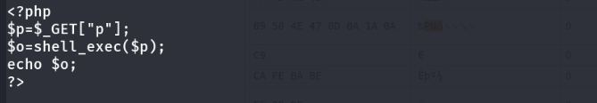
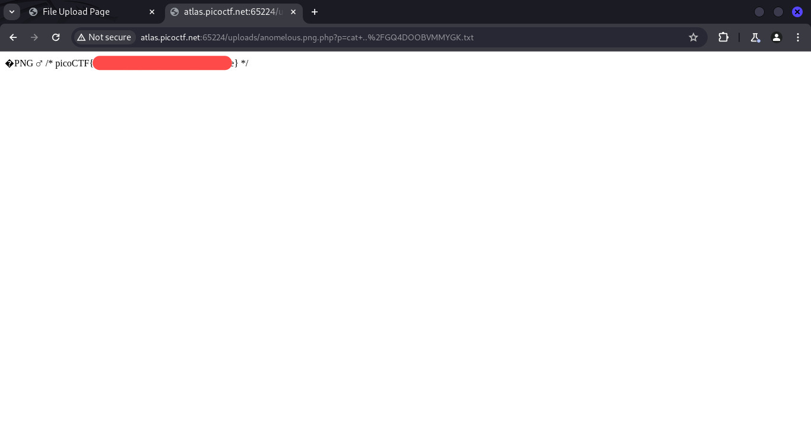

<h1 align="center">🌐 TRICKISTER Challenge 🚩</h1>

## The challenge screenshot:

## Additional Informations:
#### Hints
1. Not Hint

#### Links:
1. source code link: By launch instance

## Explain what we should do:
1. Try to know the directories structure of the website.. (we will use gobuster)
2. Try to modify the .PNG(since the server is taking the only the .PNG - it is required by the server)
3. Upload the mofified file to the website.
4. Then try to execute commands through the modified file uploaded on the system.
5. Look for flag

### Step 1:
By using [gobuster](https://github.com/OJ/gobuster), then find the directories that we may suspect that they are the storage to the uploaded files.

From the commands there we can see that the folder `uploads` is really interesting to our matter!.

### Step 2:
By using hexeditor we edited the file(which we inserted some php codes), and set the file signature as PNG.. [see more here](https://en.wikipedia.org/wiki/List_of_file_signatures) so server can see that it's png file while it's not. Also we'll rename to something like filename.png.php, so the handler from the php can be tricked to search `.png ` and confirm its picture while it's not.

This is the context which we'll insert to the file,

And edit the file using hexeditor(change the file signature),

This is before, 

This is after the modifications, using hexeditor

The file as seen from command line:
 

### Step 3:
Upload the modified file:
 

Remember all the time from the start, you should monitor using burpsuite, this is the request before modifying the request:

After the editing the request, so server can save our file without any problem:
 
On the browser we get the successfully message:
 

### Step 4:
Now our file is on the server and we can access with commands, finally we got the commands that printed the flag(you have to make several commands to look the flag):

Wow that was so easy, Now you like have 300 points, Congrats!!!

Now you got the flag!!,

## DISCLAIMER
I didn't put the flag public so I don't violate the picoCTF policy.

